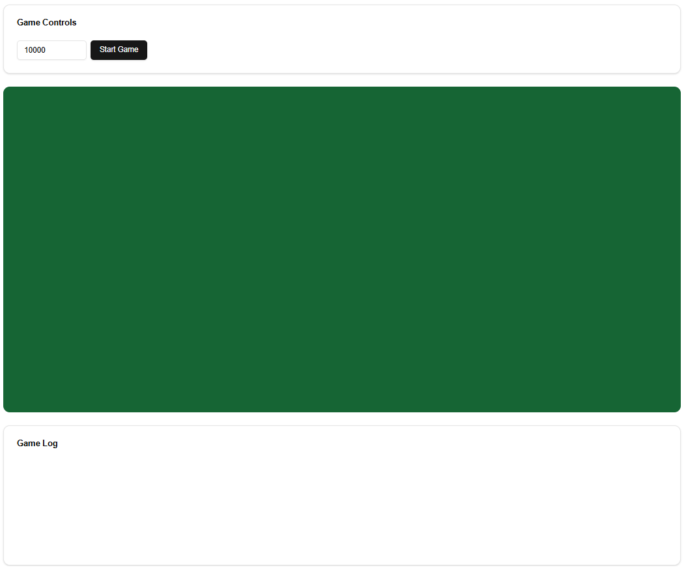
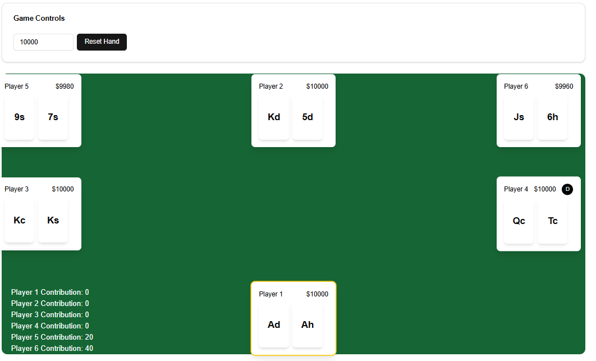
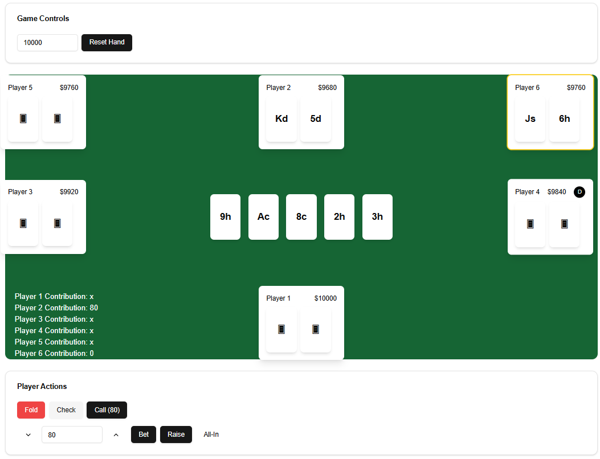
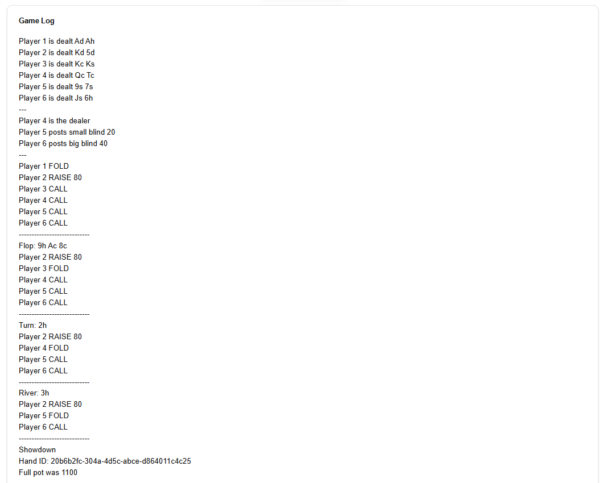
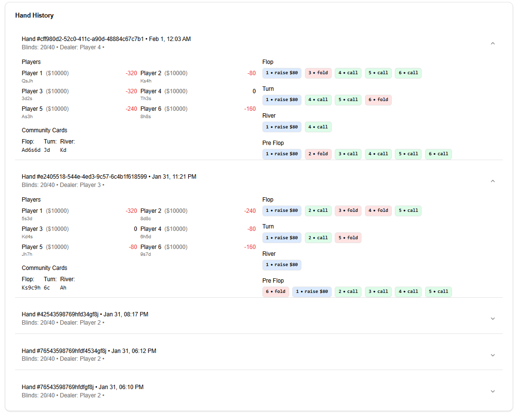

# Poker Game Platform

  
*Texas Hold'em Poker Interface*

## Project Overview

A full-stack multiplayer Texas Hold'em poker platform featuring real-time gameplay. Built with modern web technologies and containerized for easy deployment.

**Frontend**: Next.js 14 (React) @ `localhost:3000`  
**Backend**: Python FastAPI @ `localhost:8000`  
**Database**: PostgreSQL with Docker  
**Real-time Features**: WebSocket-based game synchronization

## Key Features

🎯 **Gameplay**
- Multiplayer Texas Hold'em rules implementation
- Real-time betting rounds (Pre-flop, Flop, Turn, River)
- Player actions: Fold, Check, Call, Raise, All-in
- Dynamic pot calculation and chip management
- Hand history tracking and replay

🖥️ **Interface**
- Interactive poker table visualization
- Player seat management
- Community card display
- Action log with history
- Responsive UI components

🔧 **DevOps**
- Dockerized services
- PostgreSQL database container
- Automated API documentation
- Environment configuration management

## Technology Stack

**Frontend**
- Next.js 14 (App Router)
- React 18
- TypeScript
- Shadcn UI + Tailwind CSS

**Backend**
- Python 3.11
- FastAPI
- PostgreSQL

**Infrastructure**
- Docker 24+
- Docker Compose

## Getting Started

### Prerequisites

- Docker Desktop 24.0+
- Node.js 18+
- Python 3.11+
- PostgreSQL client

### Installation

1. **Clone Repository**
   ```bash
   git clone https://github.com/willisit12/poker-platform.git
   cd poker-platform
    ```


2. **Environment Setup**
    ```bash
    cp .env.example .env
    # Update environment variables in .env
    ```

3. **Start Services**
    ```bash
    docker-compose up --build
    ```

### Running Locally

1. **Frontend Development**
    ```bash
    cd frontend
    npm install
    npm run dev
    ```

## Screenshots

*Note: Replace the placeholder paths with actual paths to your screenshot images.*

### 1.  Game Page



### 2. Start New Game



### 3. End of Game



### 4. Game Logs



### 5. Start New Game



## Contributing

Contributions are welcome! Please follow these steps to contribute:

1. **Fork the Repository**

2. **Create a New Branch**

   ```bash
   git checkout -b feature/YourFeatureName
   ```

3. **Commit Your Changes**

   ```bash
   git commit -m "Add Your Feature"
   ```

4. **Push to the Branch**

   ```bash
   git push origin feature/YourFeatureName
   ```

5. **Create a Pull Request**

   Submit a pull request detailing your changes for review.

---

## License

This project is licensed under the [MIT License](./LICENSE).

---

## Contact

For any inquiries or feedback, please contact:

- **Name**: Your Name
- **Email**: your.email@example.com
- **GitHub**: [willisit12](https://github.com/willisit12)
